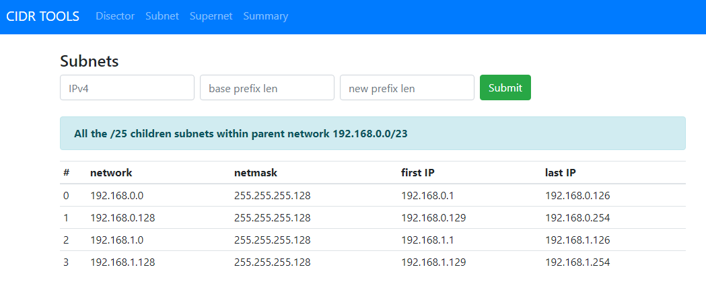

# cidrtools
As a learning excercise I wrote this Flask app utilizing the awesome netaddr Python library. Designed as subnetting tool for network engineers.

# About
*CIDR Tools* is an app to assist in network address planning/design. I wanted to learn the basics of writing a python-based web application and at the same time have a simple tool to use.  This application has the following functions:
- Disector - this takes any IPv4 address in CIDR form and shows details about it
- Subnet - is used to break up a parent network into subnets based on a new desired prefix length
- Supernet - is to show what parent networks a subnet belongs to
- Summary - given a list of hosts and/or networks, produce the summary prefix(s)
- Splitnet (in progress) - show the prefix summaries after splitting up a prefix

The results are provided in an HTML table, so data is easily cut/paste into a spreadsheet or other forms of documentation.

# Screenshot

# Future Plans
Create forms to generate complex IP address design schemas base on a design template. For example, a design template could represent a branch office, floors in a building or large campus.  The addressing schemas could then be imported into an IPAM solution such as Netbox or Infoblox.  

# Container Install and Setup

Used this great tutorial:
https://blog.entirely.digital/docker-gunicorn-and-flask/

Assumptions: Your system is already setup and running Docker version  13.1 or higher

First, clone the repo (it will create a application folder called "cidrtools")
    
    git clone https://github.com/ja3600/cidrtools.git

Change into the directory:

    cd cidrtools

Build the container (this uses the Dockerfile):

    docker build --tag flask_cidrtools .

Run it (first time) detached, as a daemon
    
    docker run --name cidrtools -d -p 5000:5000 flask_cidrtools 

Run it (first time) to see debug errors..
    
    docker run --name cidrtools -p 5000:5000 flask_cidrtools 

Stop or start it:

    docker stop cidrtools
    docker start cidrtools

Other useful Docker commands:

    docker ps -a
    docker images -a
    docker system prune
    
Login into the container (by running bash):

    docker exec -u root -t -i cidrtools /bin/bash

Copy files to a container:

    docker cp src_filename.txt cidrtools:/dst_filename.txt

Delete all containers and images:

    docker ps -a -q | xargs docker rm
    docker images -a -q | xargs docker rmi -f

# Installation Instructions without running inside a container

These instructions are based on CentOS Linux release 7.7
These steps assume your system already has python3 and pip installed
This is handy if you are developing/testing new code

Install virtual environment:

    pip install virtualenv --user

Create a new environment for Flask:

    virtualenv flask-env

Activate the new environment:

    source flask-env/bin/activate

Clone the cidr-tools files from Github:

    git clone https://github.com/ja3600/cidrtools.git

This will create a new directory called cidrtools.

Move into this new directory

    cd cidrtools

Now install Flask and other dependencies:

    pip install -r requirements

Allow port TCP 5000 through the Linux firewall, if required:

    firewall-cmd --permanent --zone=public --add-port=5000/tcp 
    firewall-cmd --reload

Run the application...

    python3 app/app.py

To enable the Flask environment automatically when you log in:

Add this line to the end of your .bashrc

    cd ~
    source ~/flask-env/bin/activate

